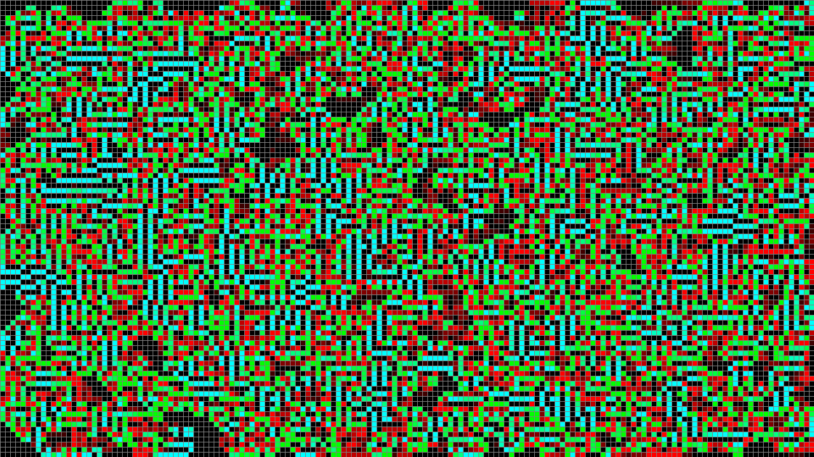

# Game of Life [BakaRecca]

CYAN          = STABLE.
GREEN- > CYAN = Became alive recently.
RED -> BLACK  = Died recently.
BLACK         = Been dead for a long time.

# BLACK <- RED | GREN -> CYAN
#    DEAD          ALIVE

